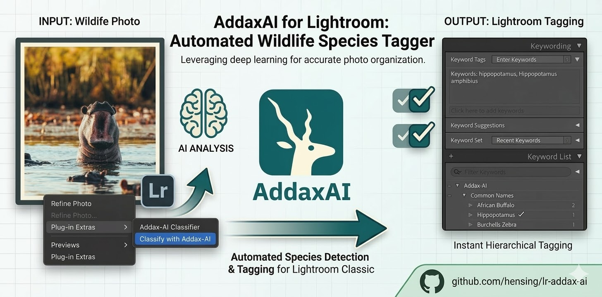

# Lightroom Addax-AI Classifier

  

A Lightroom Classic plugin to automatically classify wildlife species in your photos and videos using [Addax-AI](https://addaxdatascience.com/addaxai/).

Developed by **Dr. Henning Dickten ([@hensing](https://github.com/hensing))**.

---

## Motivation

After completing my Field Guide training and spending extensive time in the African bush, I found myself with over 12,000 photos and videos that needed sorting and tagging. Standard AI classifiers often failed to provide the necessary depth and accuracy for African wildlife.

**Addax-AI** is a state-of-the-art platform developed in collaboration with major wildlife conservation institutions (such as the Wildlife Conservation Society). It provides the highest accuracy for species identification in camera trap data and wildlife photography.

However, Addax-AI is a standalone application that doesn't natively support RAW files or integrate easily back into a Lightroom workflow. This plugin bridges that gap.

---

## Overview

This plugin allows you to select photos (including RAW files) and videos in Lightroom and have them classified by Addax-AI models.

### How it works:
1. **Temporary Export:** Selected photos and videos are exported as JPEGs. For videos, Lightroom generates a representative preview frame.
2. **GPS Support:** GPS coordinates are preserved and passed to Addax-AI for accurate reporting.
3. **AI Classification:** The plugin uses the Addax-AI Python environment to process the images. It supports multiple species detection in a single frame.
4. **Keyword Import:** Results are imported back as distinct branches:
   - **Taxonomy:** `Addax-AI > Taxonomy > [Family] > [Scientific Name]`
   - **Common Names:** `Addax-AI > Common Names > [Common Name]`

---

## Installation

1. **Prerequisites:** 
   - [Addax-AI](https://github.com/PetervanLunteren/AddaxAI) must be installed.
   - Recommended path on macOS: `/Applications/AddaxAI_files`
2. **Download Plugin:** Download this repository as a `.lrplugin` folder.
3. **Add to Lightroom:** `File > Plug-in Manager > Add`.
4. **Configure:** Set the Addax-AI path and choose your model.

### Managing Models
> [!IMPORTANT]
> To add or update models, you have to use the **Addax-AI standalone application**.

Once a model is downloaded and configured in the Addax-AI UI, it will automatically appear in the Lightroom plugin's model selection list.

---

## Configuration

- **Export Resolution:** Longer edge of temporary JPEGs (Default: 2048px).
- **Confidence Threshold:** The minimum certainty required to import a keyword (Default: 90%). High values prevent false positives.
- **Multi-Species:** Automatically tags all detected species in a single image.
- **Exclude / Forbidden:** Filter out unwanted categories (e.g., `person`, `vehicle`) or specific species by adding them to this comma-separated list.
- **Diagnostic Logging:** Enable logging via the UI checkbox to save `Addax_DebugLog.txt` and `Addax_PythonDebug.txt` to your Desktop.

### Managing Models
Models must be downloaded using the **Addax-AI standalone application**. Once a model is downloaded (and resides in a subfolder like `/Applications/AddaxAI_files/models/cls/Sub-Saharan Drylands/`), it will automatically appear in the Lightroom plugin's model selection list.

---

## Credits

Special thanks to **Peter van Lunteren** for creating [Addax-AI](https://github.com/PetervanLunteren/AddaxAI). 
Visit [addaxdatascience.com/addaxai/](https://addaxdatascience.com/addaxai/) for more.

---

## License

This project is licensed under the **GPLv3 License**. See the `LICENSE` file for details.
